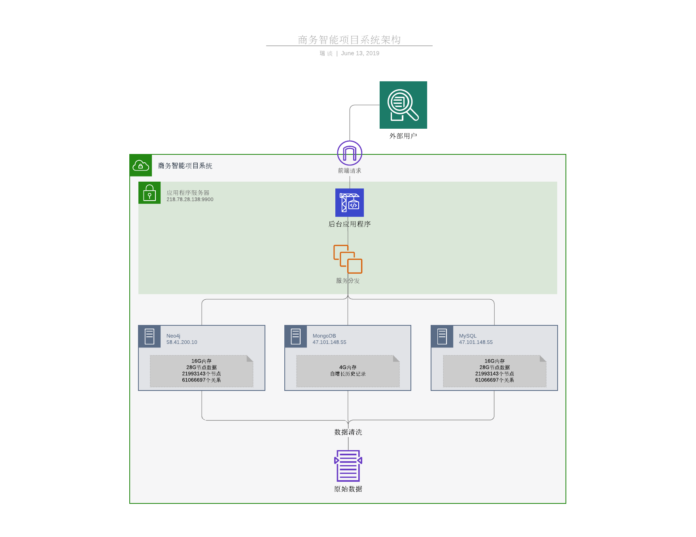

# 商务智能项目文档

## 项目架构分析

本项目是一个知识图谱展示网站。

- 前端使用vue+D3框架实现前端基本逻辑、样式设定以及数据可视化；
- 后端采用springboot框架，实现分发逻辑、图算法等功能；
- 数据库方面使用Neo4j存储基本节点及关系数据；使用MongoDB作为检索结果的缓存；使用MySQL存储所有节点名称和其对于的ID、标签。



### 类图


### 前端

#### 介绍

在我们的项目中主要使用D3组件来对数据进行展示。D3是一款强大的用于数据可视化的JavaScript库，能够展示多种类型的数据，同时对数据进行操控。


#### 导入

我们使用d3-network来展示网络状的图数据。

```
<d3-network :net-nodes="nodes" :net-links="links" :options="options" />
```

```
import D3Network from 'vue-d3-network'
  components: {
    D3Network
  }
```

```
<style src="vue-d3-network/dist/vue-d3-network.css"></style>
```

#### 事件

- **node-click**: 单击爱节点时触发事件——**(event,node-object)**
- **link-click**:单击链接时触发 ——**(event, link-object)**

#### 节点对象

- **id**：节点ID。*如果没有提供使用数组索引*
- **name**：节点名称。*如果未提供使用：'node [node_id]'*
- **_color**：节点颜色，例如*红色*，*＃aa00bb*，
- **_cssClass**：node css类名
- **_labelClass**：节点标签css类名
- **svgSym**：节点图标，svg文档（仅适用于svg渲染器）
- **_size**：节点大小*（仅限svg渲染器）*
- **_width**：节点宽度*（仅限svg渲染器）*
- **_height**：节点高度*（仅限svg渲染器）*
- **_svgAttrs**：Object，svg节点属性

由于项目节点属性与该component节点对象属性不太相符，所以需要修改component，

buildNode函数中将项目节点属性提取并填入节点对象属性。

#### 链接对象

- **id**：链接ID。*如果没有提供使用数组索引*
- **name**：节点名称。*如果未提供使用：'link [link_id]'*
- **tid**：目标节点的id
- **sid**：源节点的id
- **_color**：链接颜色，例如*红色*，*＃aa00bb*，
- **_svgAttrs**：Object，svg行属性

同节点对象一样，由于项目链接属性与该component链接对象属性不太相符，所以修改component中buildLink函数，将项目节点属性提取并填入节点对象属性。

#### props

该component为我们提供了丰富的属性，以自定义我们的需求：

**net-nodes**: 节点对象的数组

**net-links**: [链接对象的](https://github.com/emiliorizzo/vue-d3-network#link-object)数组

**selection** : **选择**对象，链接和节点

- **links**: 将node.ids作为键，将节点对象作为值的对象
- **nodes**: 将link.ids作为键的对象，将对象链接为值

**nodeSym**: String，可设置svg doc 为node绘制图标

**nodeCb**: Function(node) -> node,  节点格式化

**linkCb**: Function(link) -> link, 链接格式化

**options**:

- **canvas**：Boolean，*render as canvas*，false = svg
- **size**：对象，*图形大小*。**默认值：**容器大小
  - **w**：数字
  - **h**：数字
- **offset**：对象，*图形中心偏移量*
  - **x**：数字
  - **y**：数字
- **force**：数量
- **force**对象：
  - **中心**：*布尔值*，使用d3.forceCenter
  - **X**：*强度*，使用d3.forceX
  - **Y**：*力量*，使用d3.forceY
  - **ManyBody**：*Boolean*，使用d3.forceManyBody，*取'force'选项的负值*
  - **链接**：*布尔值*，使用d3.forceLink
- **nodeSize**: Number, node radius | 以px为单位
- **linkWidth**: Number, 链接厚度以px为单位
- **nodeLabels**: Boolean, 显示节点名称
- **linkLabels**: Boolean, 显示链接名称
- **fontSize**: Number,节点标签大小 px
- **strLinks**: Boolean, 是否将链接绘制成矩形线

## 各数据库介绍

### Neo4j

Neo4j是一种面向/基于图的数据库，以`图`的形式存储数据，而这种数据格式的结构特殊性使得其在复杂繁琐的关系处理上很高效。

本项目使用其存储路透社提供的公开金融数据集，其中包含各类金融相关实体以及多实体之间的关系。我们使用Neo4j为本项目构建了知识图谱模型，并在此基础上提供一些检索服务。

#### 配置

机器内存16G，Neo4j分配如下：

```bash
dbms.memory.heap.initial_size=1G
dbms.memory.heap.max_size=4G
dbms.memory.pagecache.size=4G
```

#### 数据量

图数据库中共存有27.34GB图数据，其中：

- 节点数：21993143
- 关系数：61066697

### MongoDB

因项目中MongoDB和MySQL存储量较少，因此都选择使用了配置较低的服务器。

使用MongoDB的目的是为了缓存检索结果，提高Query Server的响应速度。我们将特定检索关键词的字符串连接结果作为key，并创建一个包含检索时间和检索结果的value，以此构建key-value对存储MongoDB中。在下一次query动作产生时，会先检索MongoDB中是否包含该历史记录，若包含则修改该记录的time字段，并将其返回，若不包含则创建一个key-value对存入MongoDB中。

存储结构如下：

| Collections(集合名称) | 说明                             |
| --------------------- | -------------------------------- |
| Single                | 查询单节点周围的关系及节点的结果 |
| Double                | 查询两节点间存在的多跳关系的结果 |
| MinPath               | 查询两节点间的最短路径           |

每个集合的存储文档格式都相同：

| DocumentKey | 说明                    |
| ----------- | ----------------------- |
| id          | 根据检索参数构建的key值 |
| time        | 检索的时间              |
| result      | 检索结果(json类型数据)  |

由于我们项目中图结构很大，对Neo4j的一次节点、关系检索通常是比较耗时的，而MongoDB的以key取值的操作确实很快的，因此使用MongoDB大大降低了用户的检索等待时间。

#### 数据量

MongoDB中主要用于存储用户检索的历史记录，数据的增加由用户的检索动作触发，当MongoDB中的数据量达到了预先设定的阈值（2G），会清理一次数据，即删除一半的记录。

### MySQL服务器配置

与MongoDB类似，MySQL的目的也是提高Query Server的响应速度。

在用户界面中，我们为其提供了一个搜索节点的功能，即根据实体的名称来搜索并返回相似的实体集合，并由用户选择一个（或两个，由选择的检索功能而定）特定的实体从而根据其返回对应的实体/关系结果集。

虽然Neo4j在处理关系上很高效，但是在独立实体上的查询就会很慢，因此我们使用关系型数据库MySQL存储所有节点的名称、ID、类型标签及其uri链接。

唯一一张表NeoCache的表结构：

| 字段名称 | 说明         | 备注                                       |
| -------- | ------------ | ------------------------------------------ |
| id       | 节点id       | 主键                                       |
| label    | 节点所属类型 | 索引`labelIndex`、符合索引`labelNameIndex` |
| name     | 节点名称     | 索引`nameIndex`、符合索引`labelNameIndex`  |
| uri      | 节点的链接   | 可直接跳转到官网介绍页面                   |

## ETL

### 数据导入

在做数据清理的时候，我们有两种方案：

1. 原来使用数据清理 导出成csv

   优点：清理完数据比较小，可以通过neo4j import直接导入

   缺点：在清洗数据的过程中，会有一定的数据缺失

2. 使用neosemantics直接导入

   优点：数据比较完整

   缺点：数据较大，比较难导入

我们对于源数据进行了一定的分析，发现源数据采用rdf数据框架，其中URI作为语义知识图谱的唯一标示，不仅可以存储数据，还可以存储该数据含义的明确描述，例如：

\- [http://permid.org/ontology/common/hasPermId](http://permid.org/ontology/common/hasPermId)     语义知识图谱本体节点 代表了规则

\- [http://www.w3.org/1999/02/22-rdf-syntax-ns#type](http://www.w3.org/1999/02/22-rdf-syntax-ns#type) 存储了相关时间信息

因此我们决定使用第二种方法进行数据导入，保证数据信息最大程度的完整性，为了加快读写速度，增加增删改查的速率，我们选择使用固态盘进行数据存储

### 知识图谱构建

我们选择的是自下而上的方式搭建知识图谱。本体节点的存在代表了源数据的置信度相对比较高，通过数据直接构建知识图谱的方式是可行的。

在导入数据之后，我们对于本体节点进行规则抽取，本体规则的构建可以帮助我们在新的数据导入时自动判断数据的正确性。当未来数据更新的时候，我们可以通过这个规则来去除一些错误的信息。

## 查询功能实现

### 单节点及关系查询

单节点查询是Neo4j中最基本的查询，语句如下：

```sql
MATCH p=((n:$label)-[*$step]-()) where id(n)=$id return p limit $limit
```

对于节点`a`，给定四个参数`a的id`、`a的类型label`、`关系跳数限制`、`返回的路径数量限制`，直接返回其周围的关系和节点组成的结果集。

但是在数据量如此大的库里面，定位到某节点并进行扩展也会变得很慢。于是我们做了以下几种提升性能的方法：

首先，考虑到`Neo4j`在节点定位上很吃力，为了避免遍历时全文搜索，我们在`id`上创建了索引，大大增快了节点定位的速度；

其次，我们使用`MongoDB`对查询记录进行缓存，当短期内执行同样的查询时，会从`MongoDB`中摘取记录并返回，查询的速度基本是在`ms`级别，同时我们设定了记录失效时间`1天`，防止结果过于陈旧。

### 两节点多跳关系查询

Neo4j中的查询思路基本是从`起始节点s`出发进行`深度`或`广度`遍历，而后查询直至找到`终止节点e`。

广度优先的性能取决于结果节点是否靠近起始节点，即其深度；深度优先的性能取决于结果节点是在生成树的左侧还是右侧，越靠左侧就越有可能被先遍历到。而在最坏的情况下，结果节点同时位于树的最深和最右的位置，那么就需要遍历整个树即整张图。这在节点数较少的情况下还基本可以完成，而在我们项目场景中，节点周围多的可能会有几千甚至上万个关系，在BFS的情况下，N跳关系就可能需要存储1000<sup>N</sup>数量级的关系和节点，如此当N较大时，内存必然会爆炸。然而这正是Neo4j选择的查询方式。

因此我们这里选择了一个策略，首先取出`起始节点`给定范围内的最大子图，查询语句如下：

```sql
MATCH p=((n:$label)-[*$step]-()) where id(n)=$id return p limit $limit
```

这会返回`起始节点`和`终止节点` `step`跳数之内所有路径(路径数量限制为`limit`)，即两个节点的`结果子图`。据此，我们对两个子图做相交判定，期间需要两次路径过滤。第一次，我们需要一次二层嵌套循环来判断是否存在相交路径，取出所有相交路径；第二次路径过滤要解决两个问题：**合并路径**和**去关系节点**。

**合并路径**时要注意到可能出现的多关系情况，即头尾节点相同但关系不同的情况。

**去关系节点**是指数据库中可能存在很多诸如`tenureInOrganization`的节点，这些节点本身是一个关系的提取，可以认为是为了减少数据冗余，但是若存在`p:Person`—[]—`t:tenureInOrganization`—[]—>`o:Organization`这样的关系理解为`p`是`o`的主席(或其他职位)，其任期时间为`t`。这样的关系理解为`p`与`o`的直接关系应该更为恰当，意即`t`可以转化为关系。

在去关系节点操作上我们一开始进行了多个备选方案的选择：

- 数据清洗

  即把数据库中所有的`关系节点`全部连同其连接的`关系`转化为`一条关系`，但是由于我们的数据量是在太庞大，因此我们舍弃了这个做法。

- 虚拟关系

  APOC库中有一个称作VRelationship的关系，是一种类似于关系型数据库中的视图的存在，但是由于这种虚拟关系在检索是不会作为关系返回，它的生命周期只在其被创建的那一次查询中有效，因此这种方法也被舍弃了。

于是我们便考虑在后期处理。

至此我们就找到了`起始节点`和`终止节点`以及二者间的`可达路径集合`。

### 两节点最短路径查询

最短路径我们采用了Neo4j内置的`shortestPath`算法进行查找，其使用快速双向广度优先搜索算法，为避免出现暴力穷举的情况，我们在配置中设置了`cypher.forbid_exhaustive_shortestpath`为`true`。由于我们的关系上不存在权重这一说，因此我们的最短路径就是指`最短跳数`。语句如下：

```sql
MATCH (source:$sourceType),(target:$targetType) WHERE id(source) = $sourceId AND id(target) = $targetId MATCH p = shortestPath((source)-[*]-(target)) return p";
```

## 问题列表

|  **Category**  | **Question**                             | **Solution**                   |
| :------------: | ---------------------------------------- | ------------------------------ |
|      ETL       | 如何支持更大规模的数据？                 | 升级硬盘、分布式(难以实现)     |
|                | 如何更好地支持数据更新？                 | 本体规则注入，筛选错误数据     |
| Storage System | 如何更好地对图数据库进行建模？           | 自底向上                       |
|                | 如何提高查询性能？                       | 索引、约束                     |
|                | 如何增强系统的可拓展性，是否是分布式系统 | 否                             |
|  Query Server  | 如何提高查询的性能？是否可以采用缓存？   | 缓存、预热、算法优化、后期处理 |
| Visualization  | 如何让用户更好地查看检索的结果？         | 节点搜索、属性查看、关系高亮   |
|                | 是否支持沿着图进行进一步扩展？           | 否                             |

## 展望

1. 两节点多跳算法的优化：

   在目前的算法中，我们使用的是双向快速广度优先搜索的方式进行两点之间关系的查询。在实际情况中，如果一个节点相邻的节点过多的话，内存堆栈的存储压力会非常大，因此会出现查询效率低，容易宕机的情况。我们在未来的改进中，准备使用networkx复杂网络建模工具对其进行相应的改进。通过搜索子图，将两个节点所在的子图保存下来，用networkx进行分析，返回结果，从而优化两节点多跳关系的查询。

2. 节点扩展：

   目前，前端只能展示搜索结果，但是对于搜索结果中的节点无法进行进一步扩展，即无法从当前结果进行进一步的搜索。

3. 高可用与分布式：

   由于条件限制，当前的我们的数据服务器只有一个，在开发测试过程中确实出现过很多次系统宕机的情况，因此我们希望未来能加入多节点服务器。

   同时现行的Neo4j仍然是不支持分布式存储，即分库操作，希望在未来能加入这一功能。